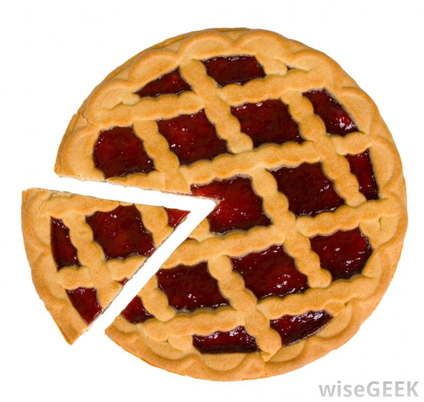

# ES6 slice() vs splice()
 


__slice()__ and __splice()__ are Javascript Array functions. 

The __slice()__ method returns the selected element(s) in a new array object, and does not change the original array.

The __splice()__ method returns the removed item(s) in an array, and does change the original array.

Confused? no?  Let me fix that.  When I take a slice of pie, I cut a piece off, and the original pie is missing a piece!  But in Javascript, __slice()__ creates a new array and does not change the original array.

And __splice()__ does change the original array, but if you splice two wires, both original wires are connected together, neither is missing anything.  Oye!  OK, now are you sufficiently confused?  Great, now you know why programming can be so difficult and confusing!  No, really, it's a mind-flip.


Maybe some examples would help clear things up.

__slice()__ is known as an accessor method which does not modify the array but instead returns a representation via a new Array object.

syntax: __arr.slice([begin[, end]])__
```
var animals = ['ant', 'bison', 'camel', 'duck', 'elephant'];

console.log(animals.slice(2));
// expected output: Array ["camel", "duck", "elephant"]

console.log(animals.slice(2, 4));
// expected output: Array ["camel", "duck"]

console.log(animals.slice(1, 5));
// expected output: Array ["bison", "camel", "duck", "elephant"]
```

__splice()__ is known as a mutator method because it does mutate the original array.

syntax: __var arrDeletedItems = array.splice(start[, deleteCount[, item1[, item2[, ...]]]])__
```
var months = ['Jan', 'March', 'April', 'June'];
months.splice(1, 0, 'Feb');
// inserts at index 1
console.log(months);
// expected output: Array ['Jan', 'Feb', 'March', 'April', 'June']

months.splice(4, 1, 'May');
// replaces 1 element at index 4
console.log(months);
// expected output: Array ['Jan', 'Feb', 'March', 'April', 'May']
```


