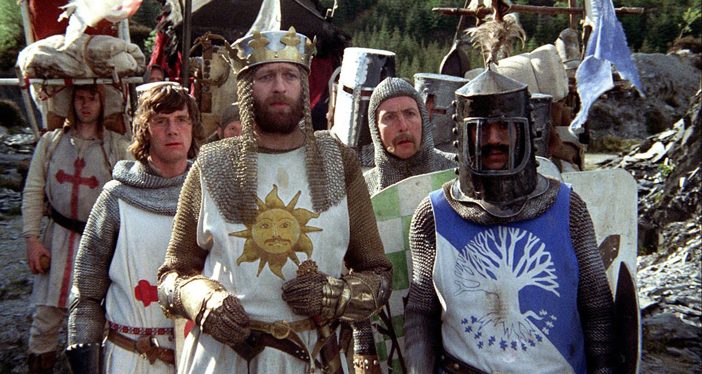

# Practice working with arrays and loops


#### [Monty Python and the Holy Grail – Bridge – Three Questions](https://bookofthrees.com/monty-python-and-the-holy-grail-bridge-three-questions/)

```
var knights = ["Sir Lancelot", "Sir Robin", "Sir Galahad", "King Arthur"];

var questions = [
  "What… is your name?",
  "What… is your quest?",
  "What… is your favourite colour?",
  "What… is your name?",
  "What… is your quest?",
  "What… is the capital of Assyria?",
  "What… is your name?",
  "What… is your quest?",
  "What… is your favourite colour?",
  "What… is your name?",
  "What… is your quest?",
  "What… is the air-speed velocity of an unladen swallow?"
];

var answers = [
  "My name is Sir Lancelot of Camelot.",
  "To seek the Holy Grail",
  "Blue",
  "Sir Robin of Camelot",
  "To seek the Holy Grail",
  "I don’t know that.",
  "Sir Galahad of Camelot",
  "I seek the Grail",
  "Blue. No, yel…",
  "It is ‘Arthur’, King of the Britons",
  "To seek the Holy Grail.",
  "What do you mean? An African or European swallow?"
];

var passage = {
  true: "Bridgekeeper: Go on. Off you go.",
  false: "Auuuuuuuugh.\n[he is thrown over the edge into the volcano]"
};

let thrownIntoVolcano = false;
let question = 0;
console.log("\n");

for (let knight = 0; knight < knights.length; knight++) {
  console.log(
    "Bridgekeeper: Stop. Who would cross the Bridge of Death must answer me these questions three, ere the other side he see."
  );
  for (let qa = 0; question < 12; question++) {
    console.log("Bridgekeeper:", questions[question]);
    console.log(knights[knight] + ":", answers[question]);

    qa++;
    if (qa > 2) {
      question++;
      if (knights[knight] == "Sir Lancelot") {
        thrownIntoVolcano = false;
        console.log(passage.true);
      } else if (
        knights[knight] == "Sir Robin" ||
        knights[knight] == "Sir Galahad"
      ) {
        thrownIntoVolcano = true;
        console.log(passage.false);
      } else if (knights[knight] == "King Arthur") {
        thrownIntoVolcano = true;
        console.log(passage.false);
        console.log(
          "footnote: King Arthur apparently read this blog => http://style.org/unladenswallow"
        );
      }

      if (knights[knight] == "Sir Robin") {
        console.log(
          "For those looking for additional answers, the four capitals of Assyria were Ashur (or Qalat Sherqat), Calah (or Nimrud), the short-lived Dur Sharrukin (or Khorsabad), and Nineveh. The ruins of all four ancient cities fall within the modern state of Iraq. => http://style.org/unladenswallow"
        );
      }
      console.log(
        "\n-----------------------------------------------------------------------\n"
      );
      break;
    }
  }
}
```
