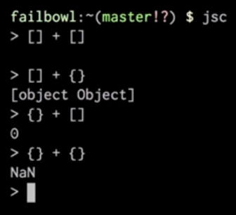
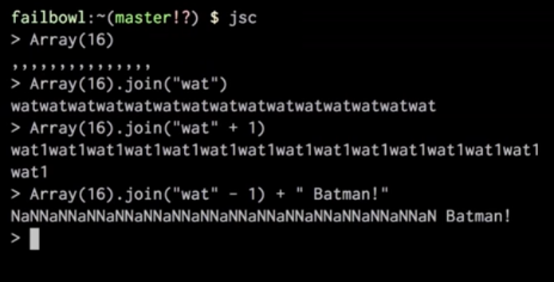
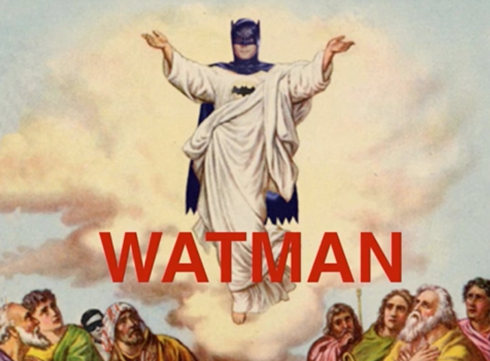

# CS50 2017 - Lecture 12 - The End

[youtube video](https://youtu.be/82zBV81rJC8?list=PLhQjrBD2T3828ZVcVzEIhsHVgjANGZveu&t=2692)
@ 44.50 +/-

```
[] + [] // ''

[] + {} // [object Object]

{} + [] // 0

{} + {} // NaN

Array(16);
// [ <16 empty items> ]
// ,,,,,,,,,,,,,

Array(16).join("wat");
// 'watwatwatwatwatwatwatwatwatwatwatwatwatwatwat'

Array(16).join("wat1");
// 'wat1wat1wat1wat1wat1wat1wat1wat1wat1wat1wat1wat1wat1wat1wat1'

Array(16).join("wat" + 1);
// 'NaNNaNNaNNaNNaNNaNNaNNaNNaNNaNNaNNaNNaNNaNNaN'

Array(16).join("wat" - 1) + " Batman!";
// 'NaNNaNNaNNaNNaNNaNNaNNaNNaNNaNNaNNaNNaNNaNNaN Batman!'

// Really though, only a geek would get it. ;)
```


