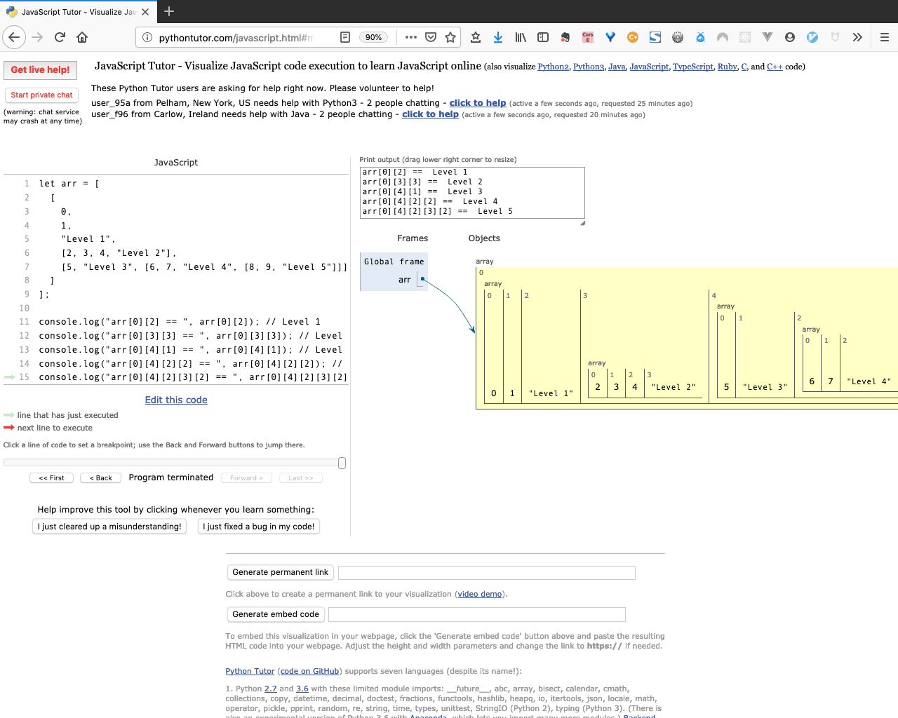

# Multi-dimensional Arrays

**freeCodeCamp** [Basic Data Structures: Create complex multi-dimensional arrays](https://learn.freecodecamp.org/javascript-algorithms-and-data-structures/basic-data-structures/create-complex-multi-dimensional-arrays)
 (Note: I obviously didn't publish the correct fCC answer here.)

Props to [pythontutor.com](pythontutor.com) for their ingenious visualization of arrays and other complex data structures.  Very helpful learning tool.





```
let arr = [
	[
		0,
		1,
		"Level 1",
		[2, 3, 4, "Level 2"],
		[5, "Level 3", [6, 7, "Level 4", [8, 9, "Level 5"]]]
	]
];

console.log("arr[0][2] == ", arr[0][2]); // Level 1
console.log("arr[0][3][3] == ", arr[0][3][3]); // Level 2
console.log("arr[0][4][1] == ", arr[0][4][1]); // Level 3
console.log("arr[0][4][2][2] == ", arr[0][4][2][2]); // Level 4
console.log("arr[0][4][2][3][2] == ", arr[0][4][2][3][2]); // Level 5

$ node mulit-d-array.js
arr[0][2] == Level 1
arr[0][3][3] == Level 2
arr[0][4][1] == Level 3
arr[0][4][2][2] == Level 4
arr[0][4][2][3][2] == Level 5
```
